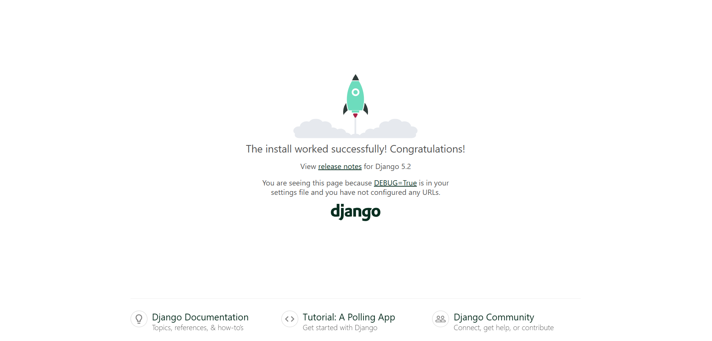

# BuyBought Django Studying

Buy-Bought is a web store site created for learning the Django framework.

## About Django

Django is a fullstack framework for building websites, APIs, and other web services in Python.

## Creating a Django Project

First of all, to create a Django project, you need to install the framework. For better maintainability, I'd recommend doing so in a virtual environment. Here's how to create one:

``` sh
# Create a virtual environment in the .venv folder
python -m venv .venv
# Activate the environment
source .venv/Scripts/activate
```

Now, to the actual Django installation:

``` sh
pip install django
```

To test if the installation was successful, you can try running `django-admin`, which should return Django's command list. If it doesn't, then something wrong isn't right.

Now, to the project scaffolding:

``` sh
django-admin startproject <project-name>
```

The above command will create a project structure like the following:

``` sh
<project-name>/
├── manage.py
└── <project-name>/
  ├── __init__.py
  ├── asgi.py        # Config for asgi servers
  ├── settings.py    # General configurations
  ├── urls.py        # Project routes
  └── wsgi.py        # Config for wsgi servers
```

## Starting the Development Server

Django provides a way to quickly bootstrap a development server. To execute it, go to the project root folder (the one with the `manage.py` script) and run:

``` sh
python manage.py runserver
```

By default, Django uses SQLite3 and runs the server in `http://127.0.0.1:8000/`, creating a new `db.sqlite3` file - if not existent - in the project directory.

## Accessing the Development Server

Now that you're executing the development server, you can already access it through the address configured (`http://127.0.0.1:8000/` by default). There, the following page will be shown, by default:



## Creating an App

Django projects are based in an app arquitecture where various apps can be created and associated with the general project. That can be used to separate the different modules of a project. Here's how to create an app (from the root folder):

```
python manage.py startapp <app-name>
```

This will create another file structure in the directory where the command was run from. If you executed it inside the project root folder, like recommended, you'll have a setup like this:

``` sh
<project-name>/
├── manage.py
├── <project-name>/
└── <app-name>/
    ├── __init__.py
    ├── admin.py         # Manage admin's view
    ├── apps.py          # App configuration
    ├── models.py        # Database models
    ├── tests.py         # Test files
    ├── views.py         # Controller and views
    └── migrations/      # Migrations for database
        └── __init__.py
```

In order for an app to be properly recognized by the Django project, its module has to be registered in the `INSTALLED_APPS` list (the module has to be relative to the root project folder).
